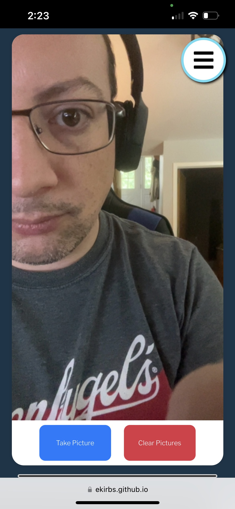
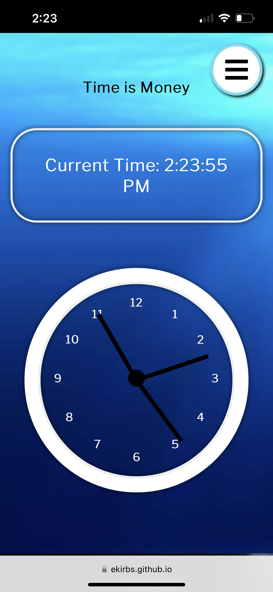
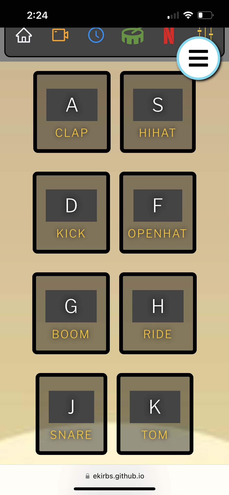
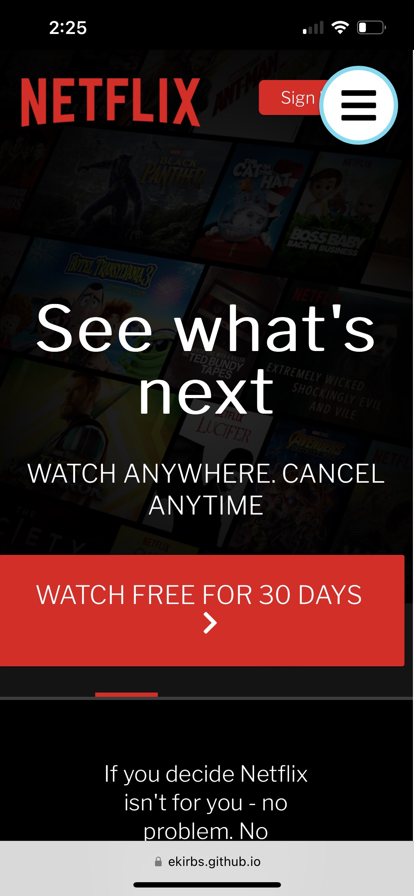
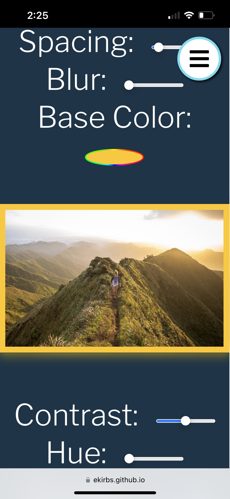

 

---

> ## Description

---

 

Welcome to my portfolio! I'm Eric Kirberger, a dedicated Full Stack Web Developer with a passion passion for growth and mastery across various programming languages and technologies. My expertise primarily revolves around Front End Development and Design.

This mobile-first, responsive portfolio is a testament to my commitment to creating well-crafted, engaging, and responsive applications. It's built with React.js and features an ever-expanding array of components and functionalities, all designed to deliver exceptional user experiences.

As you explore this portfolio, I invite you to witness my journey of continuous improvement and innovation. Should you have any inquiries or if you'd like to collaborate on projects aligned withour shared passion for excellence in web development, please don't hesitate to reach out. Thank you for visiting, and I hope you find inspiration in the work showcased here.

Link: [ Deployed Portfolio](https://ekirbs.github.io/react-portfolio/ "The portfolio of Eric Kirberger.  Made with React.js.")

Link: [GitHub Repository](https://github.com/ekirbs/react-portfolio/ "The GitHub repository of my portfolio.")

 

 

---

> ## Table of Contents

---

 

- [Installation](#installation)
- [Usage](#usage)
- [Credits](#credits)
- [License](#license)
- [Features](#features)

 

---

> ## Installation

---

 

N/A. This portfolio requires no installation. Just enjoy!

 

---

> ## Usage

---

 

The navigation bar can always be found in the top right corner of the screen. Just click on the menu button and a dropdown list provides links to different sections:

- **Home** - Back to the top we go!
- **My Work** - A showcase of my skills and a display of the various technologies I've used so far.
- **About Me** - Learn an little about me, where I've learned my skills, and what I've done in the past with a downloadable pdf of my resume.
- **Contact Me** - Information on how where and how to contact me, and a footer with some additional personal links like Instagram, LinkedIn, and GitHub.

 

---

> ## Credits

---

 

A special thanks to the developers of the packages I've utilized on this site through Node Package Manager(**npm**):

Link: [Web Dev Simplified](https://www.youtube.com/@WebDevSimplified "The Youtube channel for Web Dev Simplified.")

 

---

> ## License

---

 

This application has an MIT license. This is a short and simple permissive license with conditions only requiring preservation of copyright and license notices. For more information please refer to the license located in the github repository.

 

---

> ## Features

---

 

- My Work - a showcase of some of the applications I've built, displayed in touchscreen-capable carousel.
  - the links take you to the deployed app (if deployed) and the github repo
- Technologies - some of the technologies I've worked with
  - hover over them on desktop for the name
- Projects - some small projects I've built on the side in my spare time.  The projects shown are subject to change.
- About Me - a brief look at the man
- My Resume - a summary of professional resume with an option to download my full resume in a pdf
- Contact Me - my business contact information
  - the Google Maps is right now just generally centered on my region in the world
  - the contact form works. It will send me an email.

### ***Current Projects:***

| Title            | Description | Image                                                                   |
| :--------------- | :---------: | ----------------------------------------------------------------------: |
| Camera           | A video component that accesses the device's camera and takes temporary snapshots. |      |
| Clock            | A time display and clock built using JavaScript and CSS. |  |
| Drumkit          | An interactive drumkit and other sounds with touchscreen, keyboard, or mouse capabilities. The sound will play for as long as the button is pressed. |  |
| Netflix          | A mock-up of a Netflix landing page. |  |
| Variables        | A CSS variables component that allows the user to adjust certain settings for the image shown. |       |